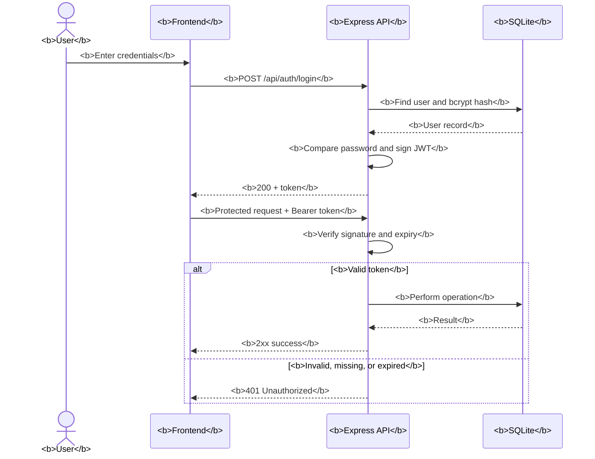

# TE6 access-control sequence

Passwords use bcrypt; tokens are expiring JWTs signed with `JWT_SECRET`.

```mermaid
sequenceDiagram
  actor U as <b>User</b>
  participant F as <b>Frontend</b>
  participant A as <b>Express API</b>
  participant D as <b>SQLite</b>
  U->>F: <b>Enter credentials</b>
  F->>A: <b>POST /api/auth/login</b>
  A->>D: <b>Find user and bcrypt hash</b>
  D-->>A: <b>User record</b>
  A->>A: <b>Compare password and sign JWT</b>
  A-->>F: <b>200 + token</b>
  F->>A: <b>Protected request + Bearer token</b>
  A->>A: <b>Verify signature and expiry</b>
  alt <b>Valid token</b>
    A->>D: <b>Perform operation</b>
    D-->>A: <b>Result</b>
    A-->>F: <b>2xx success</b>
  else <b>Invalid, missing, or expired</b>
    A-->>F: <b>401 Unauthorized</b>
  end
```
